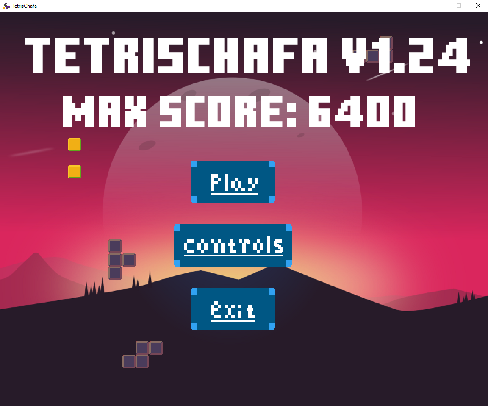
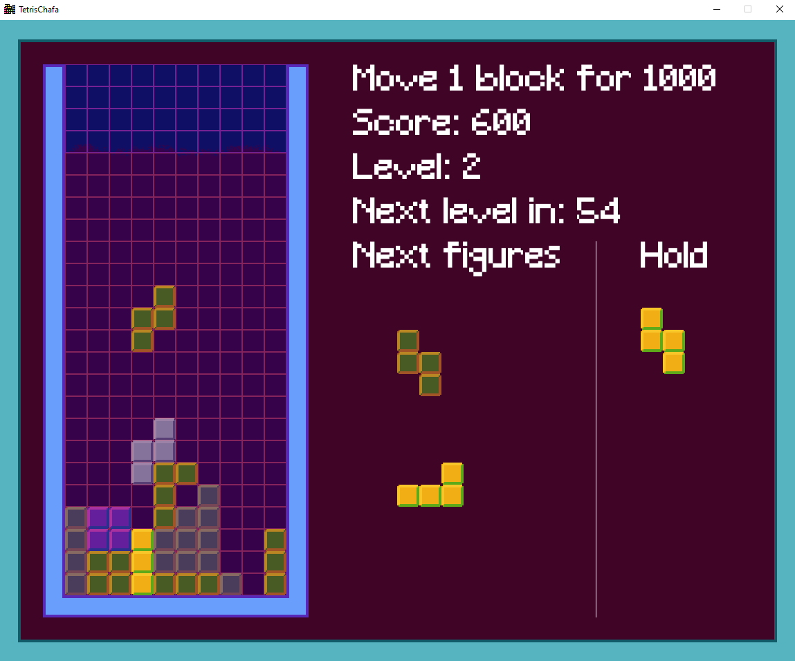

# TetrisChafa
Totally inspired by one of my favorite games, Tetris, this is my first project of this type, it is little, but I put a lot of effort into it and
I want to share it with the game developer community.

## Game Controls
* Arrows:
    * Right and left: lateral movements.
    * Down: fast fall.
    * Up: hold current piece.
* Z: counterclockwise rotation.
* X: clockwise rotation.
* Space: instant fall.
* Left click: take a block and relocate it in exchange for 1000 points.

## Table of Contents
* [General Info](#general-information)
* [Technologies Used](#technologies-used)
* [Features](#features)
* [Preview](#preview)
* [Setup](#setup)
* [Usage](#usage)
* [Project Status](#project-status)
* [Room for Improvement](#room-for-improvement)
* [Acknowledgements](#acknowledgements)
* [Contact](#contact)

## General Information
- Last Update 11/2023 (v1.23)
- Development date: (10/2021 - 11/2021) - El Salvador.
- This is a small project that I did in my free time while attending university.

## Technologies Used
- Visual Studio 2022
- C++
- Allegro.5.2.7.1

## Features 
- Menu has been added to know the controls.
- The font was changed.
- The icon was changed.
- The Background menu was changed.
- Fixed error that occurred when taking a block.

## Preview

## Setup
To play you just have to download the setup and continue installing the game, you can also download fix setup if your files get damaged or you want to uninstall the game.

## Usage
If you want to build it yourself, feel free to use and modify everything in VS-Solution; To do this you will need to have Visual Studio.

## Project Status
Project is: _complete_

## Improvements
- No problems found.

## Acknowledgements
- This project was inspired by Tetris
- Dedicated to all the people who inspire me to develop games.
- Dedicated to Katherine <3

## Contact
Created by Francisco Rosa.
<a href="mailto:francoatr2015@gmail.com">francoatr2015@gmail.com</a> - Don't worry, I'm friendly!
