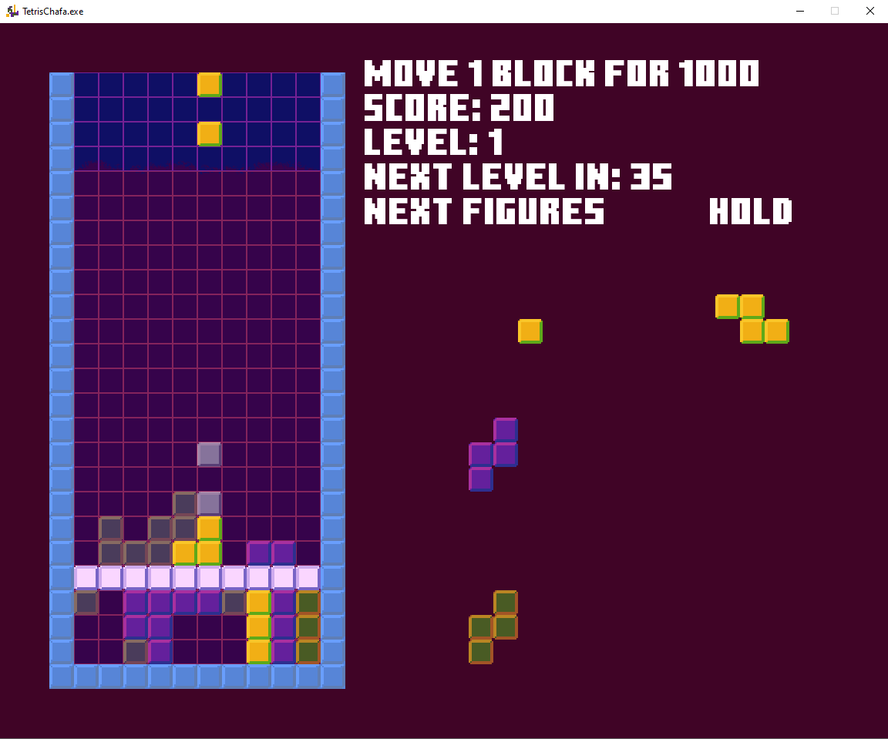

# TetrisChafa
Totally inspired by one of my favorite games, Tetris, this is my first project of this type, it is little, but I put a lot of effort into it and
I want to share it with the game developer community.

## Download
* [Direct download TetrisChafa](https://github.com/FrankoATR/TetrisChafa/blob/main/setup-tetrischafa.msi?raw=true)

## Game Controls
* Arrows:
    * Right and left: lateral movements.
    * Down: fast fall.
    * Up: hold current piece.
* Z: counterclockwise rotation.
* X: clockwise rotation.
* Space: instant fall.
* Left click: take a block and relocate it in exchange for 1000 points.

## Table of Contents
* [General Info](#general-information)
* [Technologies Used](#technologies-used)
* [Features](#features)
* [Preview](#preview)
* [Setup](#setup)
* [Usage](#usage)
* [Project Status](#project-status)
* [Room for Improvement](#room-for-improvement)
* [Acknowledgements](#acknowledgements)
* [Software License Agreement](#software-license-agreement)
* [Contact](#contact)

## General Information
- Last Update 11/2023 (v1.26)
- Development date: (10/2021 - 11/2021) - El Salvador.
- This is a small project that I did in my free time while attending university.

## Technologies Used
- Visual Studio 2022
- C++
- Allegro 5.2.7.1
- nlohmann-json 3.11.2

## Features 
- Added the option to pause the game by pressing ESC.
- Different probability values ​​have been assigned to each of the figures.
- Animation has been added when completing a row.
- The rotation of figures when they are on the edges has been improved.

## Preview

## Setup
To play you just have to download the setup and continue installing the game, you can also fix if your files get damaged or you want to uninstall the game.

## Usage
If you want to create it yourself, feel free to use and modify everything in VS-Solution; To do this you will need to have Visual Studio and install the Allegro and nlohmann-json libraries.

## Project Status
Project is: _complete_

## Improvements
- No problems found.

## Acknowledgements
- This project was inspired by Tetris
- Dedicated to all the people who inspire me to develop games.

## Software License Agreement
This Software License Agreement is a legal contract between the user and Wand, owner of the software rights of the TetrisChafa Software game. By installing, copying or otherwise using the Software, User agrees to be bound by the terms and conditions of this Agreement.

1. LICENSE OF USE

1.1 Grant of License: Wand grants the User a non-exclusive, non-transferable and revocable license to use, modify and execute the source code of the Software for the sole purpose of enjoying the gaming experience.

2. RESTRICTIONS

2.1 Prohibited Commercial Distribution: The User acknowledges and agrees that he or she does not have the right to distribute, sell, sublicense or commercialize the Software or any modification of the Software source code for profit.

2.2 Intellectual Property: The User acknowledges that TetrisChafa and all associated source code are the exclusive property of Wand. No ownership is granted in the Software, and User agrees not to claim any ownership rights in the Software.

3. MODIFICATIONS AND DERIVATIVES

3.1 Freedom of Modification: The User has the right to modify the source code of the Software for personal and non-commercial use.

3.2 Prohibition of Commercial Distribution of Derivatives: Although the User may modify the source code of the Software, he does not have the right to commercially distribute such modifications.

4. TERMINATION

4.1 License Revocation: Wand reserves the right to revoke this license in the event of your failure to comply with the terms set forth in this Agreement.

5. GENERAL PROVISIONS

5.1 Applicable Law: This Agreement shall be governed and construed in accordance with the laws of El Salvador, without regard to its conflicts of law principles.

By installing, copying or using the Software, the User acknowledges that he or she has read and understood this Agreement and agrees to comply with its terms and conditions.

Wand

Date: November 21, 2023

## Contact
Created by Francisco Rosa.
<a href="mailto:francoatr2015@gmail.com">francoatr2015@gmail.com</a> - Don't worry, I'm friendly!
